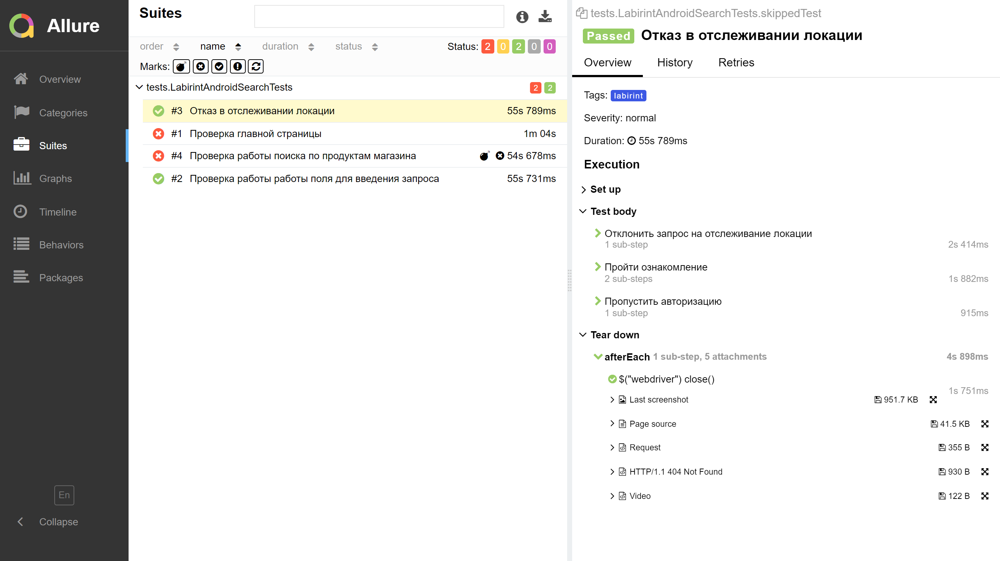
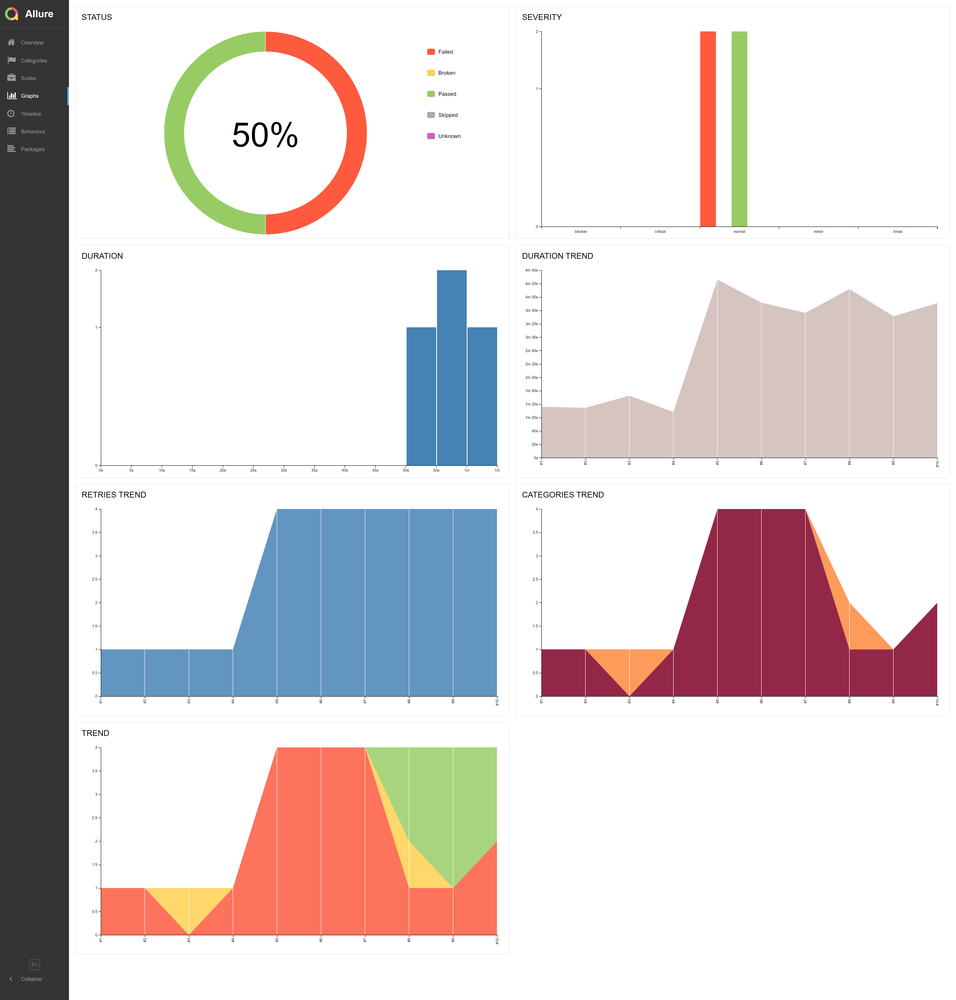

# Проект по автоматизации тестирования страницы Selecty
## :page_facing_up: Содержание:

* [Технологии и инструменты](#technologist-технологии-и-инструменты)
* [Реализованы проверки](#bookmark_tabs-реализованы-проверки)
* [Запуск тестов из терминала](#computer-Запуск-тестов-из-терминала)
* [Запуск тестов в Jenkins](#-запуск-тестов-в-jenkins)
* [Отчет о результатах тестирования в Allure Report](#-отчет-о-результатах-тестирования-в-allure-report)
* [Интеграция с Allure TestOps](#-интеграция-с-allure-testops)
* [Интеграция с Jira](#-интеграция-с-jira)
* [Уведомления в Telegram с использованием бота](#-уведомления-в-telegram-с-использованием-бота)
* [Пример запуска теста в Selenoid](#-пример-запуска-теста-в-selenoid)

## :computer: Использованный стек технологий

<code></code>
<code></code>
<code></code>
<code></code>
<code></code>
<code></code>
<code></code>
<code></code>
<code></code>
<code></code>

> *В данном проекте автотесты написаны на <code><strong>*Java*</strong></code> с использованием фреймворка <code><strong>*Selenide*</strong></code> для UI-тестов.*
>
>*Для сборки проекта используется <code><strong>*Gradle*</strong></code>.*
>
>*<code><strong>*JUnit 5*</strong></code> используется как фреймворк для модульного тестирования.*
>
>*Запуск тестов выполняется из <code><strong>*Jenkins*</strong></code>.*
>
>*<code><strong>*Selenoid*</strong></code> используется для запуска браузеров в контейнерах  <code><strong>*Docker*</strong></code>.*
>
>*<code><strong>*Allure Report, Allure TestOps, Jira, Telegram Bot*</strong></code> используются для визуализации результатов тестирования.*

## :bookmark_tabs: Реализованы проверки

### &nbsp;&nbsp;&nbsp;&nbsp;&nbsp;&nbsp; UI

>- [x] *Отказ в отслеживании локации*
>- [x] *Проверка главной страницы"*
>- [x] *Проверка работы работы поля для введения запроса*
>- [x] *Проверка работы поиска по продуктам магазина*

____

## </a> Jenkins job
<a target="_blank" href="https://jenkins.autotests.cloud/job/15.Addition_to_the_cover_letter/">**Сборка в Jenkins**</a>

  
  

### *Параметры сборки в Jenkins:*

- *TASK (запуск любого теста отдельно)*

## </a> *Allure* <a target="_blank" href="https://jenkins.autotests.cloud/job/15.Addition_to_the_cover_letter/32/allure/">*отчёт*</a>
___

### *Основная страница отчёта*

  
  

  

### *Тест кейсы*

  
  

### *Графики*

  
  
  

## </a> *Примеры видео выполнения тестов на Selenoid*

   